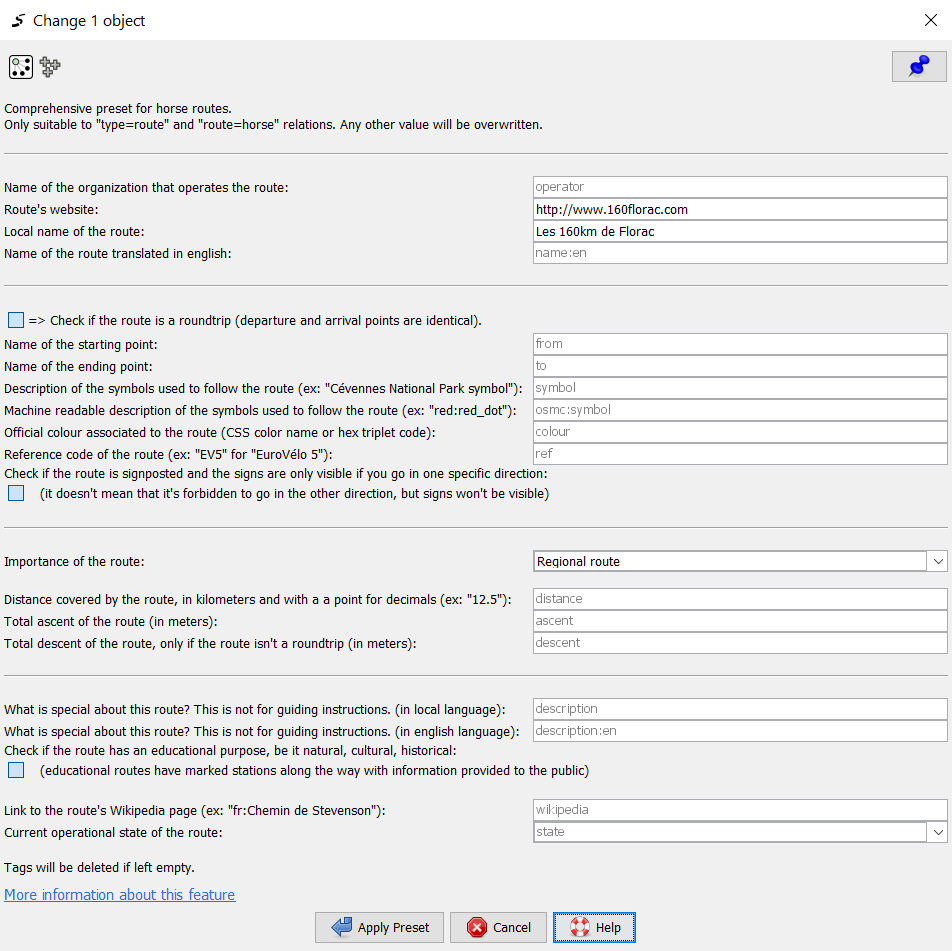

# Comprehensive presets for non-motorized routes

I was searching presets for tagging routes that were comprehensive and with really detailed descriptions, so I wrote my own nice and complete presets, for many kinds of non-motorized routes. Tags are ordered by importance.
For now adapted to all the `route` values listed [here](https://wiki.openstreetmap.org/wiki/Key:route#Non-motorized_land_routes):
- `hiking`
- `bicycle`
- `piste`
- `mtb`
- `ski`
- `horse`
- `foot`
- `running`
- `nordic_walking`
- `inline_skates`
- `transhumance`

Fully translated in french, please submit a pull request if you'd like to add a language!

Available through the JOSM presets search engine and at this address: https://josm.openstreetmap.de/wiki/Presets/NonMotorizedRoutes

## JSON Schema "Itinéraires de randonnée"

I took part to the creation of a JSON Schema on non-motorized routes, available [here](https://github.com/PnX-SI/schema_randonnee). Its goal is to standardize human-powered routes open data dissemination. In order to help people to contribute to OpenStreetMap starting from datasets compliant to this schema, I made a version of the presets that focus on the fields present in the specification: [NonMotoRizedRoutes_JSONschema_ItinerairesRandonnee.xml]

## Presets I took inspiration from

* My own [Presets/Mtbsingletrack](https://josm.openstreetmap.de/wiki/Presets/MtbSingletrack)
* Internal presets of JOSM

## Preview in JOSM

